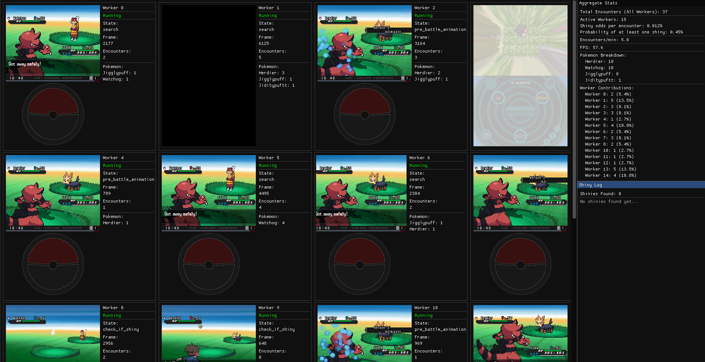

# PyShiny Hunter

> Automated shiny Pokémon hunting using Computer Vision and OCR

[](https://github.com/Konstantysz/pyshiny-hunter/actions/workflows/ci.yml)
[](https://codecov.io/gh/Konstantysz/pyshiny-hunter)
[](https://www.python.org/downloads/)
[](LICENSE.md)
[](https://github.com/astral-sh/ruff)

PyShiny Hunter is a Computer Vision-based automation tool for shiny Pokémon hunting in Pokémon Black 2 using the DeSmuME emulator. It combines image processing, OCR, and state machine patterns to detect and identify shiny Pokémon encounters automatically.

## 📸 GUI Preview



*Multi-process mode with 4 workers running simultaneously. Each worker shows live emulator feed with real-time statistics.*

## ✨ Features

- 🎯 **Automated Shiny Detection** - Identifies shiny Pokémon through animation analysis and sparkle detection
- 🔍 **Enhanced OCR Recognition** - 3-stage pipeline (EasyOCR → SymSpell → Fuzzy matching) with 100% accuracy on test dataset
- ⚡ **GPU Acceleration** - Optional CUDA support for faster OCR processing
- 📊 **Encounter Tracking** - Logs all encounters with automatic name recognition and fuzzy matching
- 🎮 **DeSmuME Integration** - Direct emulator control via py-desmume bindings
- 🖼️ **Real-time GUI** - ImGui-based monitoring interface for live progress
- ⚙️ **State Machine Architecture** - Clean, extensible design for future game support
- 🚀 **Multi-Process Mode** - Run multiple emulators simultaneously with unified GUI
- 📈 **Centralized Statistics** - Real-time encounter tracking and shiny logging across all workers

## 🛠️ Tech Stack

- **Computer Vision**: OpenCV, NumPy
- **OCR**: EasyOCR (primary), SymSpell (spell correction), RapidFuzz (fuzzy matching)
- **GPU**: Optional CUDA acceleration via PyTorch
- **Automation**: py-desmume (Nintendo DS emulator bindings)
- **Architecture**: python-statemachine
- **GUI**: ImGui + OpenGL
- **Testing**: pytest, pytest-cov
- **Quality**: Ruff, Black, MyPy, pre-commit

## 📋 Prerequisites

- **Python 3.9+** - [Download](https://www.python.org/downloads/)
- **Pokemon Black 2 ROM** - You must own the game legally

## 🚀 Quick Start

### Installation

```bash
# Clone repository
git clone https://github.com/your-username/pyshiny-hunter.git
cd pyshiny-hunter

# Create virtual environment
python -m venv venv

# Activate (Windows)
venv\Scripts\Activate.ps1
# Or Linux/macOS
source venv/bin/activate

# Install package
pip install -e .
```

### Usage

#### Single Mode (Default)

```bash
# Run with ROM and save state
pyshiny-hunter path/to/pokemon_black2.nds --state path/to/savestate.dst
```

#### Multi-Process Mode

Run multiple emulators with a unified GUI displaying all streams:

```bash
# 2 workers
pyshiny-hunter roms/black2.nds --state savestate.dst --num-workers 2

# 4 workers with randomized starts
pyshiny-hunter roms/black2.nds --state savestate.dst --num-workers 4 --randomize-start
```

Each worker runs in a separate process with live video feeds displayed in a unified GUI window. Features include:

- **Live Video Streaming** - Real-time 60 FPS feeds from all workers
- **Aggregate Statistics** - Total encounters, shiny probability, encounters/min across all workers
- **Centralized Shiny Log** - Instant notifications when any worker finds a shiny
- **Per-Worker Stats** - Individual encounter counts and Pokemon breakdown

See [docs/UNIFIED_GUI.md](docs/UNIFIED_GUI.md) for detailed architecture and troubleshooting.

### GUI Features

**Professional Horizontal Layout:**
- **Video Left, Stats Right** - Each worker panel displays emulator feed (256×384) on the left with statistics column on the right
- **Color-Coded Status** - Green = Running, Red = Stalled (no updates for >2 seconds)
- **Real-Time Updates** - 60 FPS video streaming with live frame counts and encounter tracking
- **Compact Information** - Shows up to 5 Pokemon encounters per worker with counts

**Window Management:**
- **Auto-Maximized** - Window automatically maximizes on startup for optimal viewing
- **Responsive Sizing** - Layout adapts to window resize and different screen resolutions
- **Grid Layout** - Workers arranged in optimal grid (1×1, 2×2, 2×3, 3×3, 3×4, etc.)
- **Fixed Sidebar** - Aggregate stats (top) and shiny log (bottom) always visible on right

**Aggregate Statistics Panel:**
- Total encounters across all workers
- Shiny probability calculation
- Encounters per minute
- Per-Pokemon breakdown (e.g., Watchog: 89, Patrat: 45)
- Worker contribution leaderboard

**Shiny Log Panel:**
- Last 5 shinies found with timestamps
- Worker ID and frame difference
- Save file location
- Total encounters at discovery time

### Command-Line Options

| Option              | Description                               | Required    |
| ------------------- | ----------------------------------------- | ----------- |
| `rom`               | Path to `.nds` ROM file                   | ✅ Yes      |
| `--state`           | Path to `.dst` save state file            | ❌ Optional |
| `--sav`             | Path to `.sav` save file                  | ❌ Optional |
| `--num-workers`     | Number of emulator processes (default: 1) | ❌ Optional |
| `--randomize-start` | Randomize starting frame for each worker  | ❌ Optional |

### GPU Acceleration (Optional)

For faster OCR processing, install CUDA support:

```bash
pip install -e .[cuda]
```

EasyOCR will automatically detect and use NVIDIA GPU if available. Falls back to CPU if not detected.

## 🎮 How It Works

### Computer Vision Pipeline

```text
Game Screen Capture (60 FPS)
    ↓
Region Extraction (Pokémon name area)
    ↓
Image Preprocessing
  ├─ 2× LANCZOS4 Upsampling
  ├─ Grayscale Conversion
  └─ Binary Thresholding
    ↓
Enhanced OCR Pipeline
  ├─ EasyOCR (GPU-accelerated if available)
  ├─ SymSpell spell correction
  └─ Fuzzy matching (890+ Pokémon names)
    ↓
Pokémon Identified
```

### Shiny Detection

1. **Animation Frame Counting** - Shiny Pokémon have longer entry animations (>500 frames)
2. **Sparkle Detection** - Analyzes pixel brightness in center region for sparkle effect
3. **State Machine** - Tracks game state transitions for reliable detection

### State Flow

```text
Search → Check Shiny → Pre-Battle → Battle → Found/Reset
```

## 📊 Project Structure

```text
pyshiny-hunter/
├── pyshiny_hunter/             # Main package
│   ├── hunter.py               # Abstract hunter base class
│   ├── black2_hunter.py        # Black 2 CV implementation
│   ├── py_desmume_manager.py   # Emulator integration
│   ├── cli.py                  # CLI entry point
│   ├── worker_process.py       # Headless worker processes
│   ├── gui_process.py          # Unified GUI rendering
│   ├── single_mode.py          # Single-emulator mode
│   ├── config.py               # Centralized configuration
│   └── utils/                  # Utilities & helpers
├── tests/                      # Test suite (26 tests, 91% coverage)
├── examples/                   # Jupyter notebooks & data exploration
├── resources/
│   └── pokemon_names/          # Pokémon database (Gen 1-9)
├── docs/                       # Documentation
└── .github/workflows/          # CI/CD (multi-OS, multi-Python)
```

## 📊 Performance Benchmarks

Want to measure your system's performance? Run the included benchmark suite:

```bash
# Install benchmark dependencies
pip install -e ".[examples]"

# Quick benchmark (2-3 minutes)
python examples/benchmark_performance.py --rom roms/black2.nds --state savestate.dst --quick

# Full benchmark suite (5-10 minutes)
python examples/benchmark_performance.py --rom roms/black2.nds --state savestate.dst
```

**What's Measured:**

- **OCR Performance**: CPU vs GPU speed comparison (operations per second)
- **Multi-Worker Scaling**: 1, 2, 4, 8 workers with theoretical encounters/min
- **Memory Usage**: Per-worker memory consumption
- **Startup Time**: Background OCR loading performance

**Output:**

- `benchmark_results.json` - Raw performance data
- `benchmark_results.md` - Formatted tables
- Performance charts (PNG) - Visual comparisons

See [examples/README.md](examples/README.md) for detailed benchmarking documentation.

## ⚖️ Legal Notice

**Important**: This tool requires a Pokémon Black 2 ROM file.

- ✅ **Legal**: Use ROM backups from games you physically own
- ❌ **Illegal**: Download or distribute ROM files

**This repository does NOT include ROM files** due to Nintendo copyright.

See [docs/LEGAL.md](docs/LEGAL.md) for complete copyright policy and compliance information.

## 🧪 Development

### Setup Development Environment

```bash
# Install with dev dependencies
pip install -e ".[dev]"

# Install pre-commit hooks
pre-commit install

# Run tests
pytest

# Run with coverage
pytest --cov=pyshiny_hunter --cov-report=html
```

### Code Quality

```bash
# Format code
black .

# Lint
ruff check .

# Type check
mypy pyshiny_hunter
```

### Running Tests

```bash
# All tests
pytest -v

# Specific test file
pytest tests/test_black2_hunter.py

# With coverage report
pytest --cov=pyshiny_hunter --cov-report=term-missing
```

## 🤝 Contributing

Contributions are welcome! Please see [CONTRIBUTING.md](CONTRIBUTING.md) for:

- Development setup
- Code style guidelines
- Testing requirements
- Pull request process

## 📚 Documentation

- **[Contributing Guide](CONTRIBUTING.md)** - Development guidelines and workflow
- **[Unified GUI Architecture](docs/UNIFIED_GUI.md)** - Multi-process mode details and troubleshooting
- **[Legal Notice](docs/LEGAL.md)** - Copyright policy and ROM requirements
- **[Data Exploration Notebook](examples/data_exploration_and_algorithm_design.ipynb)** - Algorithm design and validation

## 🐛 Troubleshooting

### Missing Dependencies

Make sure you're in the activated virtual environment:

```bash
pip install -e .
```

### ROM File Issues

- Place your legally-obtained `.nds` ROM in the `roms/` directory
- ROM files are NOT included in this repository due to copyright
- You must own a physical copy of the game

## 📝 License

This project is licensed under the MIT License - see [LICENSE.md](LICENSE.md) for details.

## 🎯 Project Highlights

**Production-Ready Features:**

- ✅ **Enhanced OCR** - 100% accuracy with 3-stage pipeline (EasyOCR + SymSpell + fuzzy matching)
- ✅ **91% Test Coverage** - Comprehensive pytest suite with 26 tests
- ✅ **Multi-Platform CI/CD** - GitHub Actions (Ubuntu/Windows × Python 3.9-3.12)
- ✅ **Clean Architecture** - Modular design with separation of concerns
- ✅ **Type Safety** - MyPy type checking throughout codebase
- ✅ **Code Quality** - Ruff linting, Black formatting, pre-commit hooks
- ✅ **Data-Driven** - Algorithm validation with 1,934 real-world frames
- ✅ **Professional Documentation** - Architecture diagrams, API docs, inline comments

## 🙏 Acknowledgments

- **Pokémon** is a registered trademark of Nintendo, Game Freak, and Creatures Inc.
- This project is not affiliated with or endorsed by Nintendo
- Pokémon name data compiled from public databases (PokeAPI, Bulbapedia)

## 📧 Contact

For questions or issues, please [open an issue](https://github.com/your-username/pyshiny-hunter/issues) on GitHub.

---

**Disclaimer**: This tool is for educational purposes and personal use only. Users are responsible for ensuring they comply with all applicable laws and Nintendo's terms of service.
