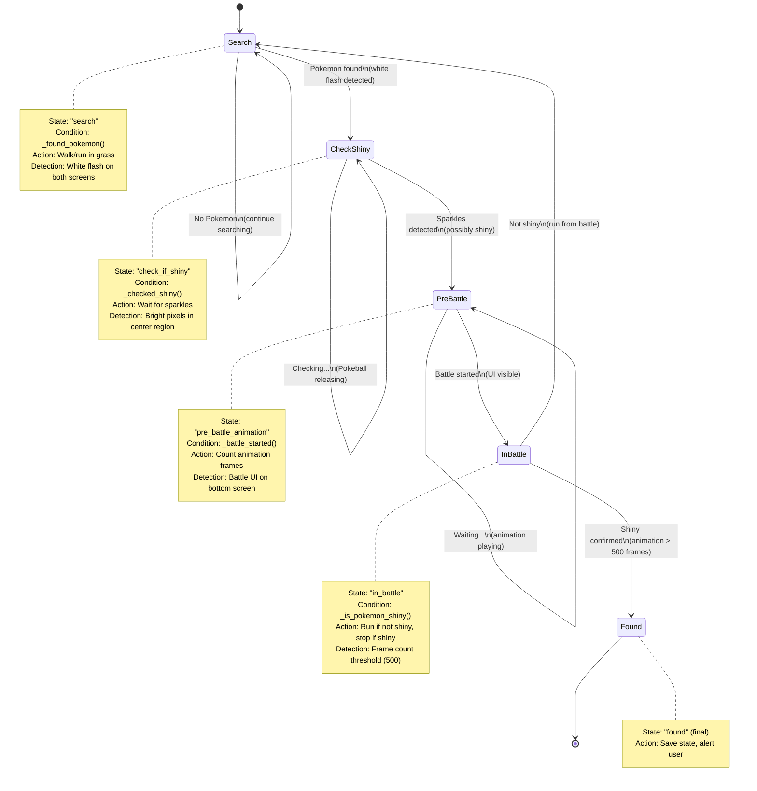

# State Machine Architecture

This document describes the finite state machine (FSM) used for shiny Pokemon hunting automation.

## Overview

The Hunter uses a 5-state FSM to manage the hunting workflow. States transition based on Computer Vision condition checks that analyze game screens in real-time.

## State Machine Diagram



## State Descriptions

### 1. Search (Initial State)

**Purpose**: Look for wild Pokemon encounters

**Transition Conditions**:
- **→ check_if_shiny**: Both top and bottom screens show white flash (avg pixel > 247)
- **→ search** (loop): No flash detected

**Actions**:
- Send directional inputs (LEFT/RIGHT) to move character
- Continuously check screens for encounter flash

**Implementation**: `Hunter.searching_pokemon(top_screen, bottom_screen)`

---

### 2. Check Shiny

**Purpose**: Detect if the encountered Pokemon is shiny by analyzing sparkle animation

**Transition Conditions**:
- **→ pre_battle_animation**: Bright pixels detected (>20% of center region above 230 brightness)
- **→ check_if_shiny** (loop): Pokeball still releasing OR not enough bright pixels

**Actions**:
- Analyze top screen center region (middle 1/3 width, top 2/3 height)
- Count bright pixels
- Run OCR to identify Pokemon species

**Implementation**: `Hunter.checking_shiny(top_screen, bottom_screen)`

---

### 3. Pre-Battle Animation

**Purpose**: Wait for battle to start while counting animation frames

**Transition Conditions**:
- **→ in_battle**: Bottom screen brightness increases (avg pixel > 55, battle UI visible)
- **→ pre_battle_animation** (loop): Animation still playing

**Actions**:
- Count frames from sparkle detection to battle start
- Record `battle_start_frame` timestamp

**Implementation**: `Hunter.waiting_for_battle_start(top_screen, bottom_screen)`

---

### 4. In Battle

**Purpose**: Determine if Pokemon is shiny based on total animation length

**Transition Conditions**:
- **→ found**: Animation length > 500 frames (shiny detected!)
- **→ search**: Animation length ≤ 500 frames (not shiny, run from battle)

**Actions**:
- Calculate total animation frames: `battle_ready_frame - battle_start_frame`
- If shiny: Save state, stop hunting
- If not shiny: Send "Run" command, return to search

**Implementation**: `Hunter.running_away(animation_frame_count)`

---

### 5. Found (Final State)

**Purpose**: Shiny Pokemon confirmed, hunting complete

**Actions**:
- Save emulator state (`.dst` file)
- Alert user (console message, GUI notification)
- Pause emulation

**Exit**: Manual user action required

---

## Condition Methods

All condition methods return `bool` and are implemented by game-specific subclasses (e.g., `Black2Hunter`).

| Method | Purpose | Detection Method |
|--------|---------|------------------|
| `_found_pokemon(top, bottom)` | Detect wild encounter | White flash (avg pixel > 247) on both screens |
| `_checked_shiny(top, bottom)` | Detect shiny sparkles | Bright pixels (>230) covering >20% of center region |
| `_battle_started(top, bottom)` | Detect battle UI | Bottom screen brightness (avg pixel > 55) |
| `_is_pokemon_shiny(frame_count)` | Confirm shiny | Animation frame count > 500 |

---

## Example Flow

**Scenario**: Finding a shiny Riolu

1. **Search** → Walking in grass, checking for white flash
2. **Search** → No encounter (loop 100 times)
3. **Search → Check Shiny** → White flash detected! (Pokemon appeared)
4. **Check Shiny** → Analyzing sparkles... 30% of center region is bright
5. **Check Shiny → Pre-Battle** → Sparkles confirmed, OCR reads "Riolu"
6. **Pre-Battle** → Counting frames... (frame 0 to 520)
7. **Pre-Battle → In Battle** → Battle UI visible (bottom screen bright)
8. **In Battle → Found** → 520 frames > 500 threshold → **SHINY RIOLU!**
9. **Found** → Save state, alert user

---

## Code Example

```python
from pyshiny_hunter.black2_hunter import Black2Hunter

hunter = Black2Hunter()

# Game loop
while True:
    top_screen, bottom_screen = emulator.get_screens()

    if hunter.current_state.id == "search":
        hunter.searching_pokemon(top_screen, bottom_screen)
        emulator.send_input("KEY_RIGHT")  # Walk in grass

    elif hunter.current_state.id == "check_if_shiny":
        hunter.checking_shiny(top_screen, bottom_screen)

    elif hunter.current_state.id == "pre_battle_animation":
        hunter.waiting_for_battle_start(top_screen, bottom_screen)

    elif hunter.current_state.id == "in_battle":
        animation_length = battle_ready_frame - battle_start_frame
        hunter.running_away(animation_length)

        if hunter.current_state.id == "found":
            print("SHINY POKEMON FOUND!")
            emulator.save_state("shiny.dst")
            break
        else:
            emulator.send_input("Run")  # Not shiny, run away
```

---

## Design Benefits

1. **Separation of Concerns**: Game-agnostic state machine, game-specific CV detection
2. **Extensibility**: Add new games by implementing 4 condition methods
3. **Testability**: Each state transition can be unit tested independently
4. **Clarity**: State flow is explicit and easy to visualize
5. **Reliability**: No missed states or undefined transitions

---

## References

- Implementation: [hunter.py](../../pyshiny_hunter/hunter.py)
- Black 2 specific: [black2_hunter.py](../../pyshiny_hunter/black2_hunter.py)
- State machine library: [python-statemachine](https://github.com/fgmacedo/python-statemachine)
